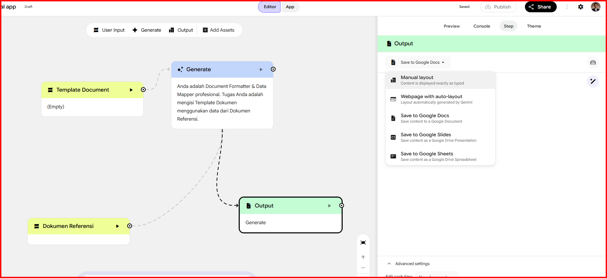

# Technical Questions & Answers

## 1. How long did you spend on the coding test? What would you add to your solution if you had more time? If you didn't spend much time on the coding test then use this as an opportunity to explain what you would add.

### Waktu yang Dihabiskan:
Saya menghabiskan waktu sekitar **2 hari** untuk menyelesaikan tantangan ini secara menyeluruh, yang dialokasikan untuk:
- Menganalisis struktur hierarki dinamis file `submission.json` (sections, fields, options, dan typed answers).
- Merancang skema database relasional PostgreSQL yang ternormalisasi lengkap dengan strategi indexing yang optimal.
- Mengimplementasikan feed consumer service yang hemat memori menggunakan **`Laravel LazyCollection` (PHP Generators)** dan transaksi database.
- Membangun RESTful API (`GET /api/form-schema`, `POST /api/upload-feed`, `POST /api/submissions`, `GET /api/submissions`) beserta validasi data.
- Membuat antarmuka frontend dinamis menggunakan Blade dan Vanilla JavaScript dengan arsitektur *Self-Healing UI* (otomatis mendeteksi jika database kosong dan menyediakan fitur unggah file JSON langsung dari browser tanpa perlu perintah CLI).
- Mengisolasi dan menyimpan berkas feed hasil unggahan di private storage (`storage/app/private/private_feeds/`).
- Menambahkan interaktivitas UX seperti notifikasi *Auto-Dismiss* (hilang otomatis setelah 4 detik).
- Menulis automated Feature dan Unit tests untuk memastikan keandalan backend.

---

### Hal-Hal yang Akan Saya Tambahkan Jika Memiliki Waktu Lebih:

1. **Pemrosesan Asinkron dengan Queue Worker (Background Jobs):**
   - Menjalankan konsumsi feed JSON berukuran sangat besar (skala ratusan megabyte/jutaan baris) di latar belakang (*background queue worker*) menggunakan Redis Queue atau Database Queue agar tidak memblokir siklus request-response HTTP.

2. **Fitur Upload Berkas Lampiran Pendukung (Supporting Documents) & Signed URL:**
   - Menambahkan komponen input upload berkas bukti insiden risiko pada setiap pertanyaan formulir dinamis (misalnya: nota koreksi, bukti transfer, atau dokumen audit dalam format PDF/JPG).
   - Menerapkan enkripsi berkas (*at-rest encryption* AES-256) pada berkas lampiran sensitif.
   - Menyediakan endpoint unduh berkas yang aman menggunakan *Temporary Signed URL* (`Storage::temporaryUrl()`) dengan masa kedaluwarsa dan proteksi hak akses ketat.

3. **Dashboard Visualisasi Data Analitik Risiko:**
   - Membangun dashboard visual interaktif (menggunakan Chart.js atau Apache ECharts) untuk menyajikan insight data analitik:
     - Total kerugian finansial aktual & potensial yang diagregasi per kuartal (Q1–Q4) dan per bulan.
     - Diagram frekuensi/heatmap kejadian risiko berdasarkan divisi yang terkena dampak.
     - Distribusi status mitigasi risiko dalam siklus insiden risiko operasional:
       - **Open**: Kejadian risiko baru diidentifikasi/dilaporkan dan sedang dalam tahap verifikasi awal.
       - **Under Investigation**: Sedang dalam analisis akar penyebab (*root cause*) dan perumusan mitigasi.
       - **Recovery**: Tahap pemulihan dana/aset sedang berjalan (seperti pada sampel data, yaitu koreksi selisih angsuran dan rekonsiliasi).
       - **Mitigated**: Langkah perbaikan sistem/SOP sudah diterapkan untuk mencegah insiden berulang.
       - **Closed**: Seluruh pemulihan selesai dan telah divalidasi oleh tim risk management/audit.

4. **Autentikasi & Role-Based Access Control (RBAC):**
   - Menerapkan Laravel Sanctum / JWT dengan manajemen hak akses (misalnya: role *Risk Officer* untuk mengisi data, role *Auditor/Manager* untuk melihat laporan agregat dan ekspor data ke Excel/PDF).

---

## 2. How would you track down a performance issue in production? Have you ever had to do this?

Ketika terjadi penurunan performa (*slowdown* atau latensi tinggi) pada aplikasi di production, saya fokus pada analisis dan optimasi query database melalui 2 langkah utama:

1. **Deteksi N+1 Query Problem:**
   - Memeriksa log query untuk mendeteksi relasi Eloquent yang dimuat berulang kali di dalam looping tanpa *eager loading*.
   - Mengatasinya dengan menerapkan *eager loading* (`with(['relation'])`) dan membatasi kolom yang ditarik (`select()`) agar query yang dijalankan ke database menjadi efisien dan minimal.

2. **Analisis Query Execution Plan (`EXPLAIN ANALYZE`):**
   - Menjalankan perintah `EXPLAIN ANALYZE` pada query SQL di PostgreSQL untuk melihat jalur eksekusi query.
   - Mengevaluasi apakah database melakukan *Sequential Scan* (membaca seluruh tabel baris per baris) pada tabel berukuran besar.
   - Jika terjadi *Sequential Scan*, solusinya adalah menambahkan *Index* atau *Composite Index* pada kolom foreign key, kolom filter/WHERE, dan kolom sorting/JOIN, serta mengoptimalkan struktur query.

---

### Pengalaman Nyata (*Real-World Experience*):

Ya, saya pernah menangani investigasi dan optimasi performa pada sistem saat terjadi kelambatan:
* **Kendala:** Endpoint pengambilan data dan laporan mengalami *slowdown* dengan waktu respons beberapa detik saat volume data mulai membesar.
* **Langkah Investigasi:**
  1. Saat memeriksa log query dan alur kode, ditemukan masalah **N+1 Query** di mana relasi data dipanggil berulang kali di dalam perulangan loop tanpa *eager loading*.
  2. Saat menjalankan perintah **`EXPLAIN ANALYZE`** pada query utama di PostgreSQL, terlihat database melakukan *Sequential Scan* pada seluruh tabel karena belum adanya indeks pada kolom foreign key dan kolom pencarian.
* **Solusi yang Diterapkan:**
  1. Mengubah query Eloquent menggunakan *eager loading* (`with(['relation'])`) dan membatasi kolom yang ditarik (`select()`).
  2. Menambahkan *Composite Index* dan indeks pada kolom relasi yang sering difilter.
* **Hasil:** Waktu eksekusi query dan respons endpoint berhasil dipangkas secara drastis menjadi jauh lebih cepat dan ringan, serta beban server kembali normal.
